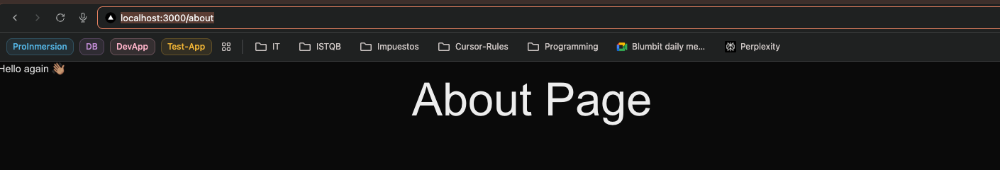
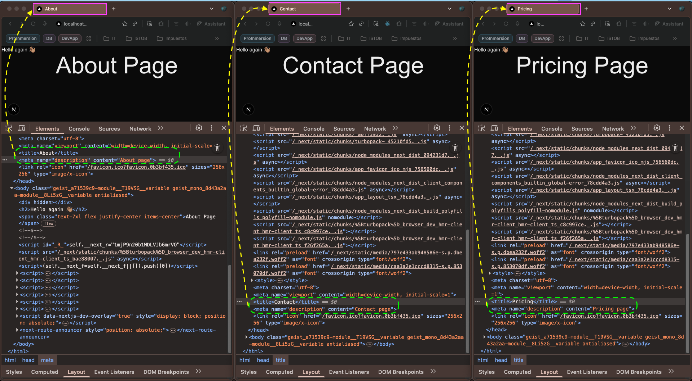
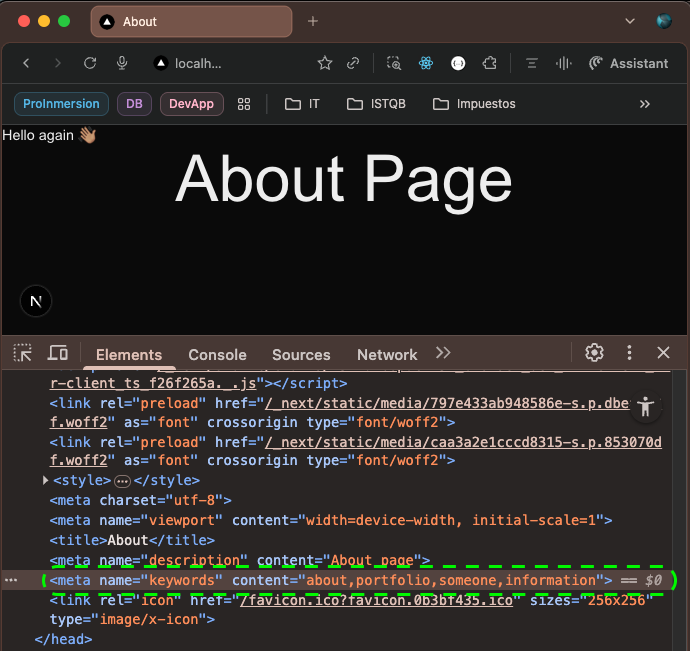
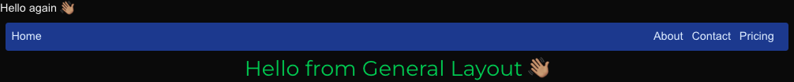
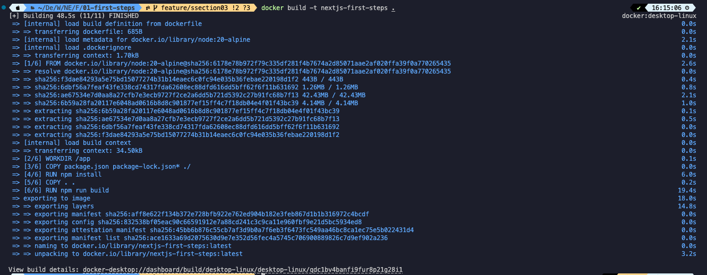

# 👨🏾‍💻 Section 02: Introduction to Next.js

## Getting Started

First, create a `Next` project
```bash
npx create-next-app [project-name]
```

Choose:
```bash
✔ Would you like to use the recommended Next.js defaults? › No, customize settings
✔ Would you like to use TypeScript? … No / `Yes`
✔ Which linter would you like to use? › `ESLint`
✔ Would you like to use React Compiler? … `No` / Yes
✔ Would you like to use Tailwind CSS? … No / `Yes`
✔ Would you like your code inside a `src/` directory? … `No` / Yes
✔ Would you like to use App Router? (recommended) … No / `Yes`
✔ Would you like to customize the import alias (`@/*` by default)? … `No` / Yes
```

Second, run the development server:

```bash
npm run dev
# or
yarn dev
# or
pnpm dev
# or
bun dev
```

Open [http://localhost:3000](http://localhost:3000) with your browser to see the result.


## 📚 Lecture 013: 
### Add `Turbo` in `package.json` file:
```json
{
  "name": "first-steps",
  "version": "0.1.0",
  "private": true,
  "scripts": {
    "dev": "next dev --turbo",   // 👈🏽 ✅
    "build": "next build",
    "start": "next start",
    "lint": "eslint"
  },
  "dependencies": {
    "next": "16.0.3",
    "react": "19.2.0",
    "react-dom": "19.2.0"
  },
  "devDependencies": {
    "@tailwindcss/postcss": "^4",
    "@types/node": "^20",
    "@types/react": "^19",
    "@types/react-dom": "^19",
    "eslint": "^9",
    "eslint-config-next": "16.0.3",
    "tailwindcss": "^4",
    "typescript": "^5"
  }
}
```

Re-start the terminal.

----

## 📚 Lecture 014: Folders and Files explanation

```
01-first-steps
│
├── .next/              # ⚙️ Auto-generated build output (never edit)
├── app/                # 📂 App Router: routes, pages, layouts, API endpoints
├── node_modules/       # 📦 Installed dependencies (auto-generated)
├── public/             # 🖼️ Static assets served directly (images, icons, etc.)
├── .gitignore          # 🚫 Tells Git which files/folders NOT to track
├── eslint.config.mjs   # 🔍 ESLint rules for code quality and formatting
├── next-env.d.ts       # 📘 TypeScript definitions for Next.js (auto-generated)
├── next.config.ts      # ⚙️ Main configuration file for Next.js behavior
├── package-lock.json   # 🔒 Locked dependency versions (auto-generated)
├── package.json        # 📑 Project metadata, dependencies, and npm scripts
├── postcss.config.mjs  # 🎨 Config for PostCSS (often used with TailwindCSS)
├── README.md           # 📄 Project documentation and setup instructions
└── tsconfig.json       # 🧠 TypeScript configuration (paths, strict mode, etc.)
```

Open `./app/layout.tsx` then add:
```tsx
import type { Metadata } from "next";
import { Geist, Geist_Mono } from "next/font/google";
import "./globals.css";

const geistSans = Geist({
  variable: "--font-geist-sans",
  subsets: ["latin"],
});

const geistMono = Geist_Mono({
  variable: "--font-geist-mono",
  subsets: ["latin"],
});

export const metadata: Metadata = {
  title: "Create Next App",
  description: "Generated by create next app",
};

export default function RootLayout({
  children,
}: Readonly<{
  children: React.ReactNode;
}>) {
  return (
    <html lang="en">
      <body
        className={`${geistSans.variable} ${geistMono.variable} antialiased`}
      >
        <h2>Hello again 👋🏽</h2>  // 👈🏽 ✅
        {children}
      </body>
    </html>
  );
}
```

---

## 📚 Lecture 015: Additional Routes

### 1. Create the **`About`** page:
```
01-first-steps
├── .next/
├── app/
│    └── about/           # AboutPage routes added   👈🏽 ✅
│         └── page.jsx    # AboutPage code           👈🏽 ✅
├── node_modules/
├── public/
├── .gitignore
├── eslint.config.mjs
├── next-env.d.ts
├── next.config.ts
├── package-lock.json
├── package.json
├── postcss.config.mjs
├── README.md
└── tsconfig.json
```  

### 2. Complete **`./app/About/page.tsx`** file:
```tsx
/* ./app/About/page.tsx */
export default function AboutPage() {
  return (
    <>
      <span>About Page</span>
    </>
  )
}
```

### 3. Go to browser and open to URL: [localhost](http://localhost:3000/about)



### 4. Add **`contact`** ad **`pricing`** pages:
```
01-first-steps
├── .next/
├── app/
│    ├── about/           
│    │    └── page.jsx    
│    ├── contact/         # 👈🏽 ✅
│    │    └── page.jsx    
│    └── pricing/         # 👈🏽 ✅
│         └── page.jsx    
├── node_modules/
├── public/
├── .gitignore
├── eslint.config.mjs
├── next-env.d.ts
├── next.config.ts
├── package-lock.json
├── package.json
├── postcss.config.mjs
├── README.md
└── tsconfig.json
```

### 5.. Update the metatags in **`./app/layout.tsx`** file:
```tsx
/* app/layout.tsx */
import type { Metadata } from "next";
import { Geist, Geist_Mono } from "next/font/google";
import "./globals.css";

const geistSans = Geist({
  variable: "--font-geist-sans",
  subsets: ["latin"],
});

const geistMono = Geist_Mono({
  variable: "--font-geist-mono",
  subsets: ["latin"],
});

export const metadata: Metadata = {
  title: "Someone's Portfolio",                       // 👈🏽 ✅
  description: "Generated by v0 - manually created",  // 👈🏽 ✅
};

export default function RootLayout({
  children,
}: Readonly<{
  children: React.ReactNode;
}>) {
  return (
    <html lang="en">
      <body
        className={`${geistSans.variable} ${geistMono.variable} antialiased`}
      >
        <h2>Hello again 👋🏽</h2>
        {children}
      </body>
    </html>
  );
}
```

---

## 📚 Lecture 016:  Metadata - Metatags

### 1. Add **`Metadata`** import in **`About`** page:
```tsx
/* ./app/about/page.tsx */
import { Metadata } from "next";      // 👈🏽 ✅

export const metadata: Metadata = {   // 👈🏽 ✅
  title: "About",
  description: "About page",
};

export default function AboutPage() {
  return (
    <>
      <span className="text-7xl flex justify-center items-center">About Page</span>
    </>
  )
}
```

### 2. Add **`Metadata`** import in **`COntact`** page:
```tsx
/* ./app/contact/page.tsx */
import { Metadata } from "next";      // 👈🏽 ✅

export const metadata: Metadata = {   // 👈🏽 ✅
  title: "Contact",
  description: "Contact page",
};

export default function ContactPage() {
  return (
    <>
      <span className="text-7xl flex justify-center items-center">Contact Page</span>
    </>
  )
}
```

### 3. Add **`Metadata`** import in **`Pricing`** page:
```tsx
/* ./app/pricing/page.tsx */
import { Metadata } from "next";      // 👈🏽 ✅

export const metadata: Metadata = {   // 👈🏽 ✅
  title: "Pricing",
  description: "Pricing page",
};

export default function PricingPage() {
  return (
    <>
      <span className="text-7xl flex justify-center items-center">Pricing Page</span>
    </>
  )
}
```

### 4. How this update is display in elements section for each page.


### 5. Add **`keywords`** in **`About`** page:
```tsx
import type { Metadata } from "next";

export const metadata: Metadata = {
  title: "About",
  description: "About page",
  keywords: ["about", "portfolio", "someone", "information"], // 👈🏽 ✅
};

export default function AboutPage() {
  return (
    <>
      <span className="text-7xl flex justify-center items-center">About Page</span>
    </>
  )
}
```



---

## 📚 Lecture 017: Layouts and Nested Layouts

### 1. Layout for whole project:
```tsx
import type { Metadata } from "next";
import { Geist, Geist_Mono } from "next/font/google";
import "./globals.css";

const geistSans = Geist({
  variable: "--font-geist-sans",
  subsets: ["latin"],
});

const geistMono = Geist_Mono({
  variable: "--font-geist-mono",
  subsets: ["latin"],
});

export const metadata: Metadata = {
  title: "Luiggie's Portfolio",
  description: "Generated by v0 - manually created",
};

export default function RootLayout({
  children,
}: Readonly<{
  children: React.ReactNode;
}>) {
  return (
    <html lang="en">
      <body
        className={`${geistSans.variable} ${geistMono.variable} antialiased`}
      >
        <h2>Hello again 👋🏽</h2> // 👈🏽 ✅
        {children}
      </body>
    </html>
  );
}
```

### 2. Layout for **`about`**, **`contact`** and **`pricing`** file - reorganize those pages:
```
01-first-steps
├── .next/
├── app/
│    └── (general)/           # 👈🏽 ✅
│        ├── layout.tsx       # 👈🏽 ✅
│        ├── about/           
│        │    └── page.jsx    
│        ├── contact/         
│        │    └── page.jsx    
│        └── pricing/         
│             └── page.jsx    
├── node_modules/
├── public/
├── .gitignore
├── eslint.config.mjs
├── next-env.d.ts
├── next.config.ts
├── package-lock.json
├── package.json
├── postcss.config.mjs
├── README.md
└── tsconfig.json
```

### 3. No URL changes:
- http://localhost:3000/about
- http://localhost:3000/contact
- http://localhost:3000/pricing
> 👉🏽 due to (general) folder

### 4. General Layout:
```tsx
import { Montserrat } from "next/font/google";

const montserrat = Montserrat({
  subsets: ["latin"],
});

export default function GeneralLayout({
  children,
}: Readonly<{
  children: React.ReactNode;
}>) {
  return (
    <div className={montserrat.className}>
      <h2 className="text-3xl flex justify-center items-center text-green-500">
        Hello from General Layout 👋🏽
      </h2>
      {children}
    </div>
  );
}
```

## 📚 Lecture 018: Navbar:

### 1. Add **`components/navbar/Navbar.tsx`** file:
```
01-first-steps
├── .next/
├── app/
│    └── (general)/           
│        ├── layout.tsx       
│        ├── about/           
│        │    └── page.jsx    
│        ├── contact/         
│        │    └── page.jsx    
│        └── pricing/         
│             └── page.jsx    
├── components/               # 👈🏽 ✅
│    ├── index.ts             # 👈🏽 ✅
│    └── navbar/              # 👈🏽 ✅
│        └── Navbar.tsx       # 👈🏽 ✅
├── node_modules/
├── public/
├── .gitignore
├── eslint.config.mjs
├── next-env.d.ts
├── next.config.ts
├── package-lock.json
├── package.json
├── postcss.config.mjs
├── README.md
└── tsconfig.json
```

### 2. Complete **`Navbar.jsx`**:
```tsx
export const Navbar = () => {
  return (
    <nav className="flex bg-blue-900 bg-opacity-30 p-2 m-2 rounded text-blue-100">
      <span>Home</span>
      <div className="flex- flex-1"></div>
      <a href="/about" className="mr-3">About</a>
      <a href="/contact" className="mr-3">Contact</a>
      <a href="/pricing" className="mr-3">Pricing</a>
    </nav>
  )
}
```

### 3. Update **`app/(general)/layout.tsx`**:
```tsx
import { Montserrat } from "next/font/google";
import { Navbar } from "@/components";  // 👈🏽 ✅ 

const montserrat = Montserrat({
  subsets: ["latin"],
});

export default function GeneralLayout({
  children,
}: Readonly<{
  children: React.ReactNode;
}>) {
  return (
    <>
      <Navbar />  // 👈🏽 ✅ 
      <div className={montserrat.className}>
        <h2 className="text-3xl flex justify-center items-center text-green-500">
          Hello from General Layout 👋🏽
        </h2>
        {children}
      </div>
    </>
  );
}
```

### 4. Visit following URLs:
- http://localhost:3000
- http://localhost:3000/about
- http://localhost:3000/contact
- http://localhost:3000/pricing




## 📚 Lecture 020: Next/Link

### 1. Install **`Octicons`**:
```bash
npm i @primer/octicons-react
```

### 2. Modify **`Navbar`** component:
```tsx
import Link from "next/link";  // 👈🏽 ✅
import { HomeIcon } from "@primer/octicons-react";  // 👈🏽 ✅

export const Navbar = () => {
  return (
    <nav className="flex bg-blue-900 bg-opacity-30 p-2 m-2 rounded text-blue-100">
      <Link href="/" className="flex items-center mr-2">
        <HomeIcon /> <span>Home</span>  // 👈🏽 ✅
      </Link>  // 👈🏽 ✅
      <div className="flex- flex-1"></div>
      <Link href="/about" className="mr-3">
        About
      </Link>  // 👈🏽 ✅
      <Link href="/contact" className="mr-3">
        Contact
      </Link>
      <Link href="/pricing" className="mr-3">
        Pricing
      </Link>  // 👈🏽 ✅
    </nav>
  );
};
```

### 3. Apply map:
```tsx
import Link from "next/link";
import { HomeIcon } from "@primer/octicons-react";

const navItems = [
  { href: "/about", label: "About" },
  { href: "/contact", label: "Contact" },
  { href: "/pricing", label: "Pricing" },
];  // 👈🏽 ✅

export const Navbar = () => {
  return (
    <nav className="flex bg-blue-900 bg-opacity-30 p-2 m-2 rounded text-blue-100">
      <Link href="/" className="flex items-center mr-2">
        <HomeIcon /> <span>Home</span>
      </Link>
      <div className="flex- flex-1"></div>
      {navItems.map((navItem) => (  // 👈🏽 ✅
        <Link key={navItem.href} href={navItem.href} className="mr-3">
          {navItem.label}
        </Link>
      ))}  // 👈🏽 ✅
    </nav>
  );
};
```

## 📚 Lecture 022: usePathname - ActiveLink

### 1. Add **`components/active-link/ActiveLink.tsx`** file:
```
01-first-steps
├── .next/
├── app/
│    └── (general)/           
│        ├── layout.tsx       
│        ├── about/           
│        │    └── page.jsx    
│        ├── contact/         
│        │    └── page.jsx    
│        └── pricing/         
│             └── page.jsx    
├── components/                       
│    ├── active-link                    # 👈🏽 ✅
│    │    ├── ActiveLink.module.css     # 👈🏽 ✅      
│    │    └── ActiveLink.tsx            # 👈🏽 ✅     
│    ├── index.ts             
│    └── navbar/              
│        └── Navbar.tsx       
├── node_modules/
├── public/
├── .gitignore
├── eslint.config.mjs
├── next-env.d.ts
├── next.config.ts
├── package-lock.json
├── package.json
├── postcss.config.mjs
├── README.md
└── tsconfig.json
```

### 2. **`ActiveLink.module.css`**:
```css
@reference "tailwindcss";

.link {
  @apply hover:underline hover:text-blue-400 mr-2 transition-all
}

.active-link {
  @apply text-blue-500  font-bold
}
```

### 3. **`ActiveLink.tsx`**:
```tsx
"use client";

import Link from "next/link";
import style from "./ActiveLink.module.css";
import { usePathname } from "next/navigation";

interface Props {
  path: string;
  text: string;
}

export const ActiveLink = ({ path, text }: Props) => {
  const pathName = usePathname();
  return (
    <Link href={path} className={` ${style.link} ${(pathName === path) && style["active-link"]} `}>
      {text}
    </Link>
  );
};
```

### 4. **`index.ts`**
```ts
export * from "./navbar/Navbar";

// Client Components
export { ActiveLink } from "./active-link/ActiveLink";
```

### 5. **`Navbar.tsx`**:
```tsx
import Link from "next/link";
import { HomeIcon } from "@primer/octicons-react";
import { ActiveLink } from "../active-link/ActiveLink";

const navItems = [
  { path: "/about", text: "About" },
  { path: "/contact", text: "Contact" },
  { path: "/pricing", text: "Pricing" },
];

export const Navbar = () => {
  return (
    <nav className="flex bg-blue-900 bg-opacity-30 p-2 m-2 rounded text-blue-100">
      <Link href="/" className="flex items-center mr-2">
        <HomeIcon /> <span>Home</span>
      </Link>
      <div className="flex- flex-1"></div>
      {navItems.map((navItem) => {
        return <ActiveLink key={navItem.path} {...navItem} />;
      })}
    </nav>
  );
};
```
---

# 👨🏾‍💻 Section 03: Deployment to Vercel and Docker images

## 📚 Lecture 031. Docker - Simple Build

### 1. Create **`.dockerignore`**:
```dockerignore
# -------------------------------------------------------
#  .dockerignore - Best Practice Template (English Only)
#  Purpose: Reduce build context, avoid sensitive files,
#  speed up docker builds, and prevent bloated images.
# -------------------------------------------------------
.dockerignore 

# ============================
#  DEPENDENCIES & BUILD ARTIFACTS
# ============================
node_modules
vendor/
venv/
env/
.venv/
__pycache__/
*.py[cod]
dist/
build/
target/
out/

# ============================
#  VERSION CONTROL
# ============================
.git
.gitignore
.gitattributes

# ============================
#  DEBUG / TEST FILES
# ============================
coverage/
.nyc_output/
*.lcov
*.test.js
*.test.ts
tests/
__tests__/

# ============================
#  LOGS & TEMP FILES
# ============================
*.log
logs/
*.tmp
tmp/
.cache/
*.swp

# ============================
#  SECRETS / SECURITY
#  (These should NOT be in source control)
# ============================
.env
*.env
*.key
*.pem
*.crt
secrets/
credentials/
certs/

# ============================
#  CI/CD & LOCAL CONFIGS
# ============================
.github/
.gitlab-ci.yml
.circleci/
docker-compose.override.yml

# ============================
#  OS & EDITOR FILES
# ============================
# macOS
.DS_Store
# Windows
Thumbs.db
# IDEs
.vscode/
.idea/
*.sublime-project
*.sublime-workspace

# ============================
#  BINARY / EXECUTABLE FILES
# ============================
*.exe
*.dll
*.so
*.dylib
*.bin

# ============================
#  DOCUMENTS (not required in builds unless needed)
# ============================
*.md
*.pdf
*.zip
*.tar.gz
docs/
```

### 2. Create **`dockerfile`**:
```yaml
# Use a small and efficient Node.js base image (Alpine = lightweight Linux)
FROM node:18-alpine

# Set the working directory inside the container
WORKDIR /app

# Copy only the package files first (this allows Docker caching of dependencies)
COPY package.json package-lock.json* ./

# Install only production dependencies unless dev build is needed
RUN npm install --omit=dev

# Copy the rest of the application code into the container
COPY . /

# Build the application (useful for React, Next.js, TypeScript transpilation, etc.)
RUN npm run build

# The container will listen on this port
EXPOSE 3000

# Command executed when the container starts (start the app)
CMD ["npm", "start"]
```

### 3. Build a docker image from terminal:
```bash
docker build -t nextjs-first-steps .
```




## 📚 Lecture 0
## 📚 Lecture 0
